# Memoria de Actividades SQL: DML y Transacciones

**Alumno:** Francisco Tomás Gilarte Galán  
**Módulo:** 
Base de datos
**Fecha:** 20 de marzo de 2026  

---

## Bloque 1: Preparación del Entorno

Para poder realizar la práctica sin disponer del esquema original `OE`, se han creado previamente las tablas `productos_u4` e `inventario_u4` con una estructura similar y datos de prueba base.

```sql
CREATE TABLE productos_u4 (
    product_id          NUMBER(6) PRIMARY KEY,
    product_name        VARCHAR2(50),
    product_description VARCHAR2(1000),
    category_id         NUMBER(2),
    list_price          NUMBER(8,2),
    min_price           NUMBER(8,2),
    product_status      VARCHAR2(20)
);

CREATE TABLE inventario_u4 (
    product_id       NUMBER(6),
    warehouse_id     NUMBER(3),
    quantity_on_hand NUMBER(8),
    CONSTRAINT pk_inv PRIMARY KEY (product_id, warehouse_id)
);
```
---

## Bloque 2: Bloque de insercion

Para poder realizar la práctica sin disponer del esquema original `OE`, se han creado previamente las tablas `productos_u4` e `inventario_u4` con una estructura similar y datos de prueba base.
1. Insertar un nuevo producto básico con ID 7000.
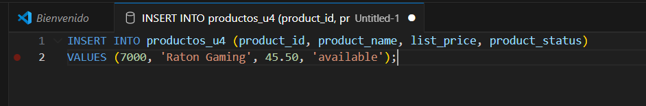
2. Insertar un producto especificando todas las columnas.
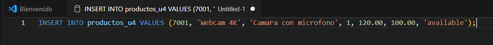
3. Insertar un producto omitiendo las columnas que no son obligatorias.
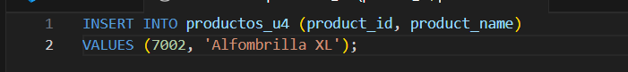
4. Insertar un producto calculando su precio (ej. un 21% más sobre una base).
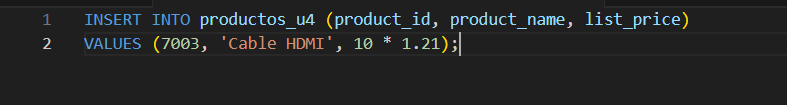
5. Insertar un producto usando una subconsulta para obtener el precio medio.
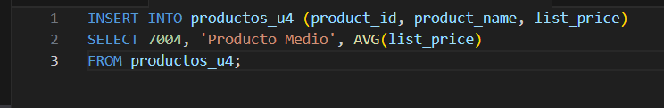
6. Insertar un producto copiando datos de otro, pero con distinto ID.
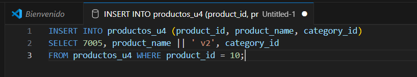
7. Insertar un producto con estado 'obsolete'.
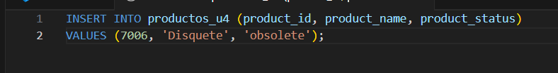
8. Insertar un producto cuyo precio mínimo sea igual al precio mínimo de toda la tabla.
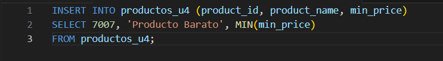
9. Insertar masivamente productos copiando aquellos con precio mayor a 100 (sumando 5000 a su ID).
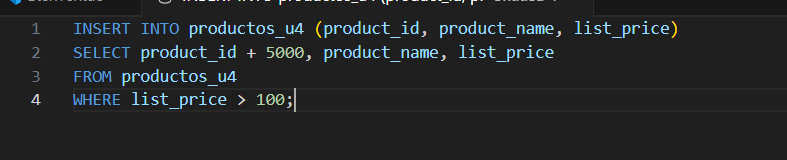

---

## Bloque 3: Bloque de modificación

1. Actualizar el estado del producto 7000 a 'obsolete'.
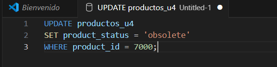
2. Subir el precio de lista un 10% a los productos de la categoría 1.
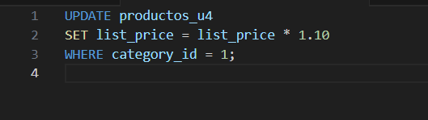
3. Cambiar la descripción del producto 7001.
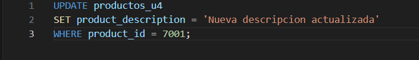
4. Igualar el min_price al list_price para los productos 'obsolete'.
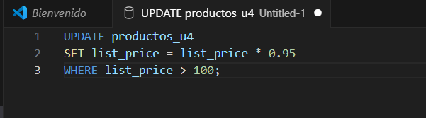
5. Bajar el precio un 5% a los productos que cuesten más de 100.
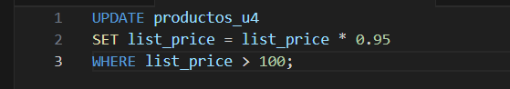
6. Actualizar el estado a 'discontinued' de los productos con ID mayor a 7002.
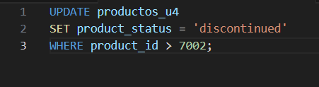
7. Cambiar la categoría del producto 7000 a la categoría del producto 30 (Subconsulta).
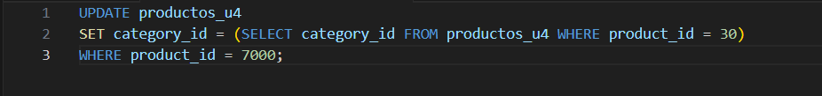
8. Actualizar el precio del producto 20 al precio medio de la categoría 1 (Subconsulta).
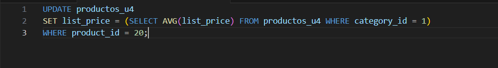
9. Actualizar estado a 'out of stock' si el producto tiene stock 0 en inventario.
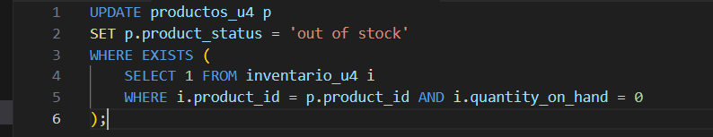

---

## Bloque 4: Bloque de Borrado

1. Borrar el producto con ID 7000.

2. Borrar los productos con estado 'discontinued'.

3. Borrar los productos cuyo precio de lista sea menor que 50.

4. Borrar los productos usando LIKE (ejemplo: contengan la palabra 'Raton').

5. Borrar los productos 7001 y 7002 usando la cláusula IN.
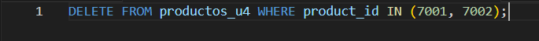
6. Borrar usanddo subconsulta: productos cuyo precio sea mayor al precio medio global.
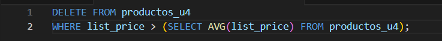
7. Borrar los productos de la tabla inventario que tengan cantidad 0.

8. Borrar productos que no existan en la tabla de inventario (Borrado relacional).
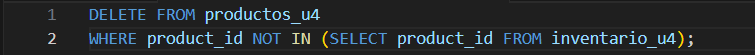
9. Limpiar todos los registros de prueba creados en los insert masivos.


---

## Bloque 5: Transacciones y concurrencias.

Paso 5.1: Preparación de tabla para pruebas

### Escenario 1: Atomicidad y uso de ROLLBACK

```sql
-- Paso 2: Asegurarnos de tener la tabla con el registro inicial de 1000€
CREATE TABLE cuenta_bancaria (
    id_cuenta NUMBER PRIMARY KEY,
    saldo NUMBER(10,2)
);
INSERT INTO cuenta_bancaria VALUES (1, 1000);
COMMIT;

-- Paso 3: Ejecutamos la resta de 100€
UPDATE cuenta_bancaria 
SET saldo = saldo - 100 
WHERE id_cuenta = 1;

-- Paso 4: Hacemos el SELECT para comprobar que ha bajado a 900€
SELECT * FROM cuenta_bancaria WHERE id_cuenta = 1;

-- Paso 5: Simulamos el error del sistema ejecutando el ROLLBACK
ROLLBACK;

-- Paso 6: Volvemos a hacer el SELECT para comprobar que el saldo ha vuelto a 1000€
SELECT * FROM cuenta_bancaria WHERE id_cuenta = 1;
```
### Escenario 2: Uso de SAVEPOINT para retornos parciales


```sql
-- Paso 1: Comprobamos el estado inicial de nuestras cuentas
SELECT * FROM cuenta_bancaria;

-- Paso 2: Hacemos una operación correcta (Ej. Ingresamos 200€ a la cuenta 2)
UPDATE cuenta_bancaria 
SET saldo = saldo + 200 
WHERE id_cuenta = 2;

-- Paso 3: Creamos un punto de guardado (SAVEPOINT) porque hasta aquí todo está bien
SAVEPOINT punto_seguro;

-- Paso 4: Hacemos una segunda operación simulando un error grave (Ej. Vaciamos la cuenta 1 por accidente)
UPDATE cuenta_bancaria 
SET saldo = 0 
WHERE id_cuenta = 1;

-- Paso 5: Comprobamos el desastre (La cuenta 1 está a 0)
SELECT * FROM cuenta_bancaria;

-- Paso 6: Deshacemos SOLO hasta el punto de guardado, salvando la operación de la cuenta 2
ROLLBACK TO punto_seguro;

-- Paso 7: Confirmamos definitivamente los cambios correctos en la base de datos
COMMIT;

-- Paso 8: Comprobamos que la cuenta 2 tiene sus 200€ extra, pero la cuenta 1 recuperó su saldo original
SELECT * FROM cuenta_bancaria;

```

```sql
-- Nos aseguramos de que la cuenta 1 tiene 1000€
SELECT * FROM cuenta_bancaria WHERE id_cuenta = 1;

-- El Cajero 1 intenta retirar 50€
UPDATE cuenta_bancaria 
SET saldo = saldo - 50 
WHERE id_cuenta = 1;

-- El Cajero 2 intenta ingresar 50€ en la misma cuenta al mismo tiempo
UPDATE cuenta_bancaria 
SET saldo = saldo + 50 
WHERE id_cuenta = 1;

-- El Cajero 1 termina su operación guardando los cambios
COMMIT;

-- Al hacer COMMIT en la Terminal 1, la Terminal 2 se desbloquea automáticamente 
-- y ejecuta su UPDATE con éxito.

-- Ahora el Cajero 2 también guarda sus cambios:
COMMIT;

-- Verificamos el saldo final. Como restamos 50 y sumamos 50, debe volver a 1000€.
SELECT * FROM cuenta_bancaria WHERE id_cuenta = 1;